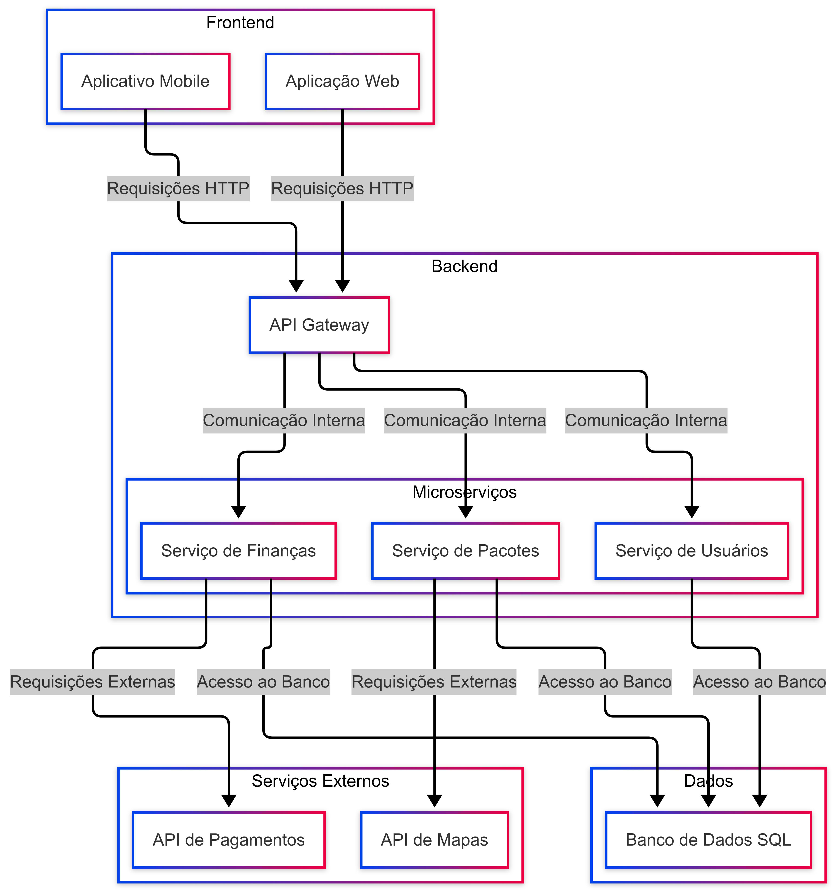

Documentação de Arquitetura

Este documento descreve a arquitetura de software do projeto "Descarte Vivo", detalhando sua estrutura, componentes, padrões de design e as decisões técnicas que guiaram o seu planejamento.

## 1. Descrição da Arquitetura

A arquitetura do "Descarte Vivo" é baseada no padrão Microserviços. Essa abordagem divide a aplicação em serviços pequenos, autônomos e fracamente acoplados, que se comunicam por meio de APIs. Cada microserviço é responsável por uma função de negócio específica, o que garante maior escalabilidade, resiliência e flexibilidade no desenvolvimento.

A arquitetura é dividida em três camadas principais:

- **Apresentação (Frontend):** Responsável pelas interfaces de usuário, acessíveis via web e dispositivos móveis.

- **Lógica de Negócio (Backend):** Consiste nos microserviços que processam todas as regras de negócio.

- **Dados:** Camada de persistência, utilizando um banco de dados relacional e serviços auxiliares.

## 2. Componentes do Sistema

Os principais componentes do sistema são:

- **Frontend Web:** A interface para acesso via navegadores de desktop. Será usada por usuários que preferem uma tela maior para gerenciar pacotes, visualizar o mapa e a loja.

- **Frontend Mobile:** A aplicação nativa para smartphones, otimizada para o uso em movimento, com recursos como geolocalização para coleta e descarte.

- **Serviço de Usuários:** Gerencia o cadastro, autenticação e perfis dos usuários.

- **Serviço de Pacotes e Logística:** O núcleo da plataforma. Controla o ciclo de vida dos pacotes, desde a criação até a conclusão da transação.

- **Serviço de Finanças e Loja:** Gerencia as transações de moedas verdes, a compra/venda de moedas com dinheiro real e o catálogo da loja.

- **Banco de Dados (PostgreSQL):** O sistema de gerenciamento de banco de dados (SGBD) relacional que armazena todas as informações estruturadas da aplicação.

- **Serviços Externos:** APIs de terceiros que adicionam funcionalidades importantes, como a API de Geolocalização (ex: Google Maps) para o rastreamento dos pacotes e a API de Pagamentos para a conversão de reais em moedas verdes.

## 3. Padrões Arquiteturais Utilizados

- **Microserviços:** Utilizado para desacoplar as funcionalidades da aplicação em serviços independentes. Isso permite que diferentes equipes trabalhem em paralelo e que cada serviço seja escalado de forma individual, de acordo com a demanda.

- **RESTful API:** Padrão de comunicação para as APIs do backend. As APIs utilizam os métodos HTTP padrão (GET, POST, PUT) para realizar operações nos recursos do sistema, garantindo clareza e padronização.

- **Arquitetura Cliente-Servidor:** O modelo fundamental onde o frontend (cliente) faz requisições aos microserviços do backend (servidor) para obter e manipular dados.

## 4. Diagrama de Arquitetura

Este diagrama ilustra a comunicação entre os componentes do sistema.

    Snippet de código

    graph TD

    subgraph Frontend
        A[Aplicativo Mobile]
        B[Aplicação Web]
    end

    subgraph Backend
        C[API Gateway]
        subgraph Microserviços
            D[Serviço de Usuários]
            E[Serviço de Pacotes]
            F[Serviço de Finanças]
        end
    end

    subgraph Dados
        G[Banco de Dados SQL]
    end

    subgraph Serviços Externos
        H[API de Mapas]
        I[API de Pagamentos]
    end

    A -- Requisições HTTP --> C
    B -- Requisições HTTP --> C
    C -- Comunicação Interna --> D
    C -- Comunicação Interna --> E
    C -- Comunicação Interna --> F

    D -- Acesso ao Banco --> G
    E -- Acesso ao Banco --> G
    F -- Acesso ao Banco --> G
    
    E -- Requisições Externas --> H
    F -- Requisições Externas --> I

## 5. Decisões Técnicas e Justificativas

### Escolha do Padrão de Microserviços:

- **Justificativa:** Decidimos não usar uma arquitetura monolítica para evitar o acoplamento entre as funcionalidades. A arquitetura de microserviços oferece a flexibilidade necessária para o crescimento da plataforma, permitindo que novas funcionalidades (como um sistema de reputação ou de leilões de pacotes) sejam adicionadas sem afetar todo o sistema.

### Escolha do Banco de Dados Relacional (PostgreSQL):

- **Justificativa:** As transações de moedas verdes e o gerenciamento de usuários e pacotes exigem integridade e consistência de dados. O PostgreSQL, com sua capacidade de garantir atomicidade em transações, é a escolha ideal para um sistema que lida com dados financeiros.

### Escolha de Frontend (React e React Native):

- **Justificativa:** React e React Native permitem o reuso de código, o que acelera o desenvolvimento. Com eles, a equipe pode construir as interfaces web e mobile de forma mais coesa, garantindo uma experiência de usuário consistente.

Diagrama da Arquitetura

