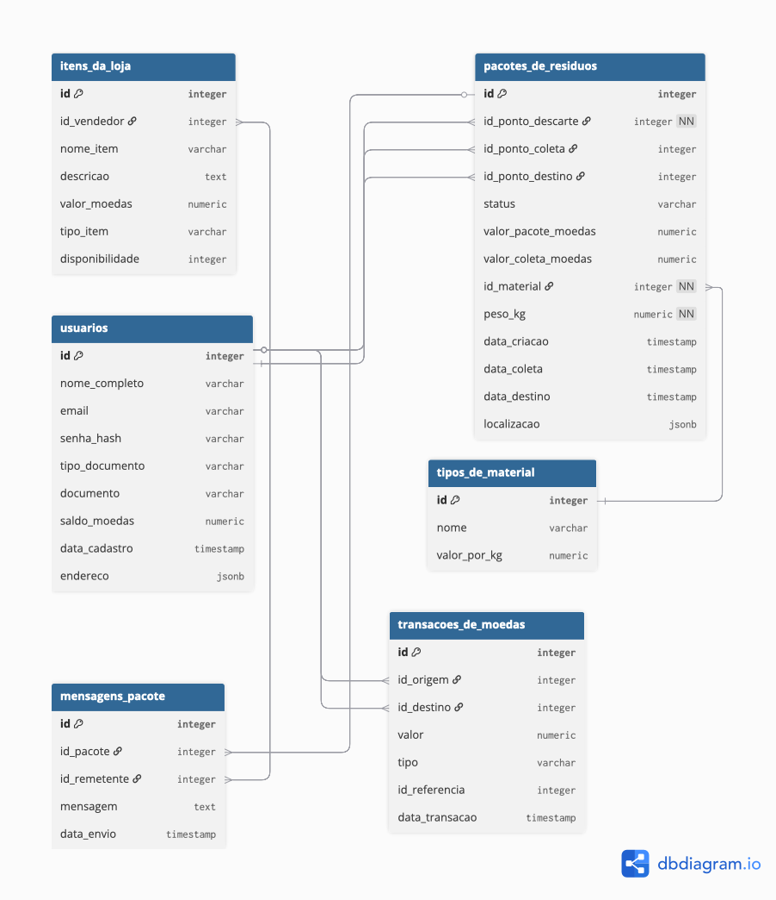

# Modelagem do Banco de Dados

Este documento descreve a estrutura e os relacionamentos do banco de dados relacional (PostgreSQL) para a plataforma Descarte Vivo. O modelo de dados foi projetado para suportar a dinâmica de múltiplos papéis de usuário, o rastreamento da logística de pacotes de resíduos e o sistema de recompensas baseado em uma loja virtual.

## Entidades e Atributos

A seguir, estão as principais entidades (tabelas) do sistema, seus atributos e a descrição de suas funcionalidades.

### 1. `usuarios`
Representa os usuários da plataforma, sejam eles cidadãos, catadores, empresas ou administradores.
- `id` (chave primária, serial): Identificador único do usuário.
- `nome_completo` (varchar): Nome completo do usuário.
- `email` (varchar, unique): Endereço de e-mail e login do usuário.
- `senha_hash` (varchar): Senha criptografada do usuário.
- `saldo_moedas` (numeric): Saldo atual de moedas verdes do usuário.
- `data_cadastro` (timestamp): Data e hora do cadastro.
- `endereco` (jsonb): Endereço completo, incluindo rua, número, cidade, estado e CEP.

### 2. `papeis_de_usuario`
Tabela de ligação que permite a um usuário ter múltiplos papéis no sistema (descarte, coleta ou destino).
- `id` (chave primária, serial): Identificador único do papel.
- `id_usuario` (integer, chave estrangeira): Referência ao usuário.
- `papel` (varchar): O papel do usuário ('descarte', 'coleta', 'destino').

### 3. `tipos_de_material`
Cataloga os diferentes tipos de materiais recicláveis e orgânicos aceitos.
- `id` (chave primária, serial): Identificador único do tipo de material.
- `nome` (varchar, unique): Nome do material (ex: 'Plástico', 'Vidro', 'Orgânico').
- `valor_por_kg` (numeric): Valor base em moedas verdes por quilograma.

### 4. `pacotes_de_residuos`
Rastreia a criação e a logística de um pacote de resíduos, desde o descarte até a destinação final.
- `id` (chave primária, serial): Identificador único do pacote.
- `id_ponto_descarte` (integer, chave estrangeira): Referência ao usuário que criou o pacote.
- `id_ponto_coleta` (integer, chave estrangeira, nulo): Referência ao usuário que coletou o pacote (nulo até ser coletado).
- `id_ponto_destino` (integer, chave estrangeira, nulo): Referência ao usuário ou empresa que recebeu o pacote (nulo até ser destinado).
- `status` (varchar): Situação do pacote ('pendente_coleta', 'em_coleta', 'pendente_destino', 'concluido').
- `data_criacao` (timestamp): Data e hora da criação do pacote.
- `data_coleta` (timestamp, nulo): Data e hora da coleta.
- `data_destino` (timestamp, nulo): Data e hora da destinação.
- `localizacao` (jsonb): Coordenadas geográficas do pacote.

### 5. `itens_do_pacote`
Detalha os materiais contidos em cada pacote.
- `id` (chave primária, serial): Identificador único do item.
- `id_pacote` (integer, chave estrangeira): Referência ao pacote de resíduos.
- `id_material` (integer, chave estrangeira): Referência ao tipo de material.
- `peso_kg` (numeric): Peso do material em quilogramas.

### 6. `lojas`
Entidades que podem oferecer produtos/serviços na loja virtual.
- `id` (chave primária, serial): Identificador único da empresa.
- `nome_fantasia` (varchar): Nome comercial da empresa.
- `cnpj` (varchar, unique): CNPJ da empresa.
- `responsavel_id` (integer, chave estrangeira): Referência ao usuário responsável pela gestão da empresa na plataforma.

### 7. `itens_da_loja`
Produtos ou serviços que podem ser comprados com moedas verdes.
- `id` (chave primária, serial): Identificador único do item.
- `id_loja` (integer, chave estrangeira): Referência à loja que oferece o item.
- `nome_item` (varchar): Nome do produto ou serviço.
- `descricao` (text): Descrição detalhada do item.
- `valor_moedas` (numeric): Valor de resgate em moedas verdes.
- `tipo_item` (varchar): Categoria do item ('produto', 'servico', 'cupom').
- `disponibilidade` (integer): Quantidade em estoque.

### 8. `transacoes_de_moedas`
Registra toda a movimentação de moedas verdes (crédito e débito).
- `id` (chave primária, serial): Identificador único da transação.
- `id_usuario` (integer, chave estrangeira): Usuário envolvido na transação.
- `valor` (numeric): Quantidade de moedas.
- `tipo` (varchar): Tipo de transação ('credito' ou 'debito').
- `origem` (varchar): Origem da transação ('pacote' ou 'loja').
- `id_referencia` (integer, nulo): ID do pacote ou do item da loja que originou a transação.
- `data_transacao` (timestamp): Data e hora da transação.

## Relacionamentos

Abaixo, um resumo dos principais relacionamentos entre as tabelas:

- `usuarios` **(1:N)** `papeis_de_usuario`: Um usuário pode ter vários papéis.
- `usuarios` **(1:N)** `pacotes_de_residuos`: Um usuário pode ser um ponto de descarte, coleta ou destino para vários pacotes.
- `pacotes_de_residuos` **(1:N)** `itens_do_pacote`: Um pacote é composto por vários itens.
- `tipos_de_material` **(1:N)** `itens_do_pacote`: Um tipo de material pode estar em vários pacotes.
- `usuarios` **(1:N)** `transacoes_de_moedas`: Um usuário pode ter várias transações.
- `usuarios` **(1:N)** `empresas`: Uma empresa tem um usuário responsável.
- `empresas` **(1:N)** `itens_da_loja`: Uma empresa pode cadastrar vários itens.

